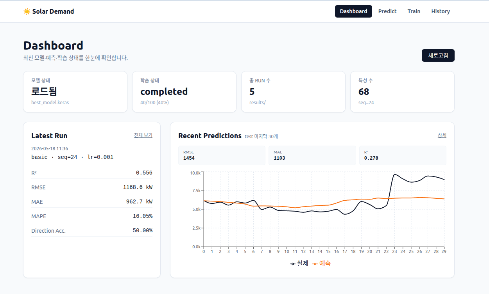

# 🌞 CNN-LSTM 태양광 발전 기반 전력 수요 예측 시스템

태양광 발전 데이터(`Plant_*_Generation_Data.csv`)와 기상 데이터(`Plant_*_Weather_Sensor_Data.csv`)를 융합하여
**CNN-LSTM 하이브리드 딥러닝 모델**로 전력 수요를 예측하는 풀스택 시스템입니다.

- **Backend**: FastAPI + TensorFlow/Keras (모델 서빙 + 학습 트리거 + SSE 진행률 스트리밍)
- **Frontend**: React 18 + TypeScript + Vite + TailwindCSS + Recharts (Dashboard / Predict / Train / History)
- **ML Pipeline**: `SolarDataLoader → SolarFeatureEngineer → CNNLSTMBuilder → ModelTrainer → ResultVisualizer`

> 📐 상세 설계 문서: [`docs/ARCHITECTURE.md`](docs/ARCHITECTURE.md) · [`docs/UML.md`](docs/UML.md)

---

## 🖼️ 데모



> Dashboard 페이지 — 모델 상태·학습 진행률·총 run 수·특성 수 카드와 Latest Run 요약, 그리고 test 마지막 30개에 대한 **실제 vs 예측** 차트를 한 화면에 표시합니다.

---

## 📋 주요 기능

| 영역 | 기능 |
|------|------|
| 데이터 | CSV 로드 → 시간별 집계 → 발전/기상 병합 → (없으면) 합성 데이터 생성 |
| 특성 | 시간/순환(sin·cos)/래그/롤링/효율성/상호작용 특성 + 시퀀스(`(N, 24, F)`) 생성 |
| 모델 | Basic / **Advanced**(Bi-LSTM + Time-step Attention + Multi-scale CNN) / Transformer |
| 학습 | 조기 종료, 학습률 스케줄링, 그리드 서치, K-fold CV, 앙상블 |
| 서빙 | FastAPI REST + SSE, 학습 완료 시 best_model.keras **hot-swap** |
| UI | 헬스/최근 예측 차트, 학습 트리거 + 실시간 epoch 진행률, run 이력/학습곡선 조회 |

---

## 🗂️ 프로젝트 구조

```
solar-power-prediction/
├── backend/
│   ├── app/                       # FastAPI 애플리케이션
│   │   ├── main.py                # 앱 엔트리 + CORS + lifespan(모델 로드/hot-swap)
│   │   ├── deps.py                # AppState (모델 + 피처 파이프라인 인메모리 캐시)
│   │   ├── schemas.py             # Pydantic 응답 스키마
│   │   ├── training.py            # TrainingManager(싱글톤) + SSE 큐 + StreamingCallback
│   │   └── routers/
│   │       ├── predict.py         # /api/health, /api/predict/recent
│   │       ├── train.py           # /api/train, /api/train/status, /api/train/stream/{run_id}
│   │       └── runs.py            # /api/runs, /api/runs/{run_id}
│   ├── data_loader.py             # SolarDataLoader
│   ├── feature_engineer.py        # SolarFeatureEngineer
│   ├── cnn_lstm_model.py          # CNNLSTMBuilder, CustomLosses, ModelEnsemble
│   ├── model_trainer.py           # ModelTrainer, HyperparameterTuner
│   ├── visualizer.py              # ResultVisualizer
│   ├── main_pipeline.py           # SolarPowerPredictionPipeline (오케스트레이터)
│   ├── run_example.py             # 메뉴 기반 실행 예제
│   ├── config_sample.json
│   ├── requirements.txt
│   ├── Plant_*.csv                # 입력 데이터 (Kaggle)
│   └── results/                   # 학습 산출물 (best_model.keras, summary_*.json …)
├── frontend/
│   ├── src/
│   │   ├── App.tsx                # BrowserRouter (Dashboard/Predict/Train/History)
│   │   ├── main.tsx
│   │   ├── components/            # NavBar, MetricCard
│   │   ├── pages/                 # DashboardPage / PredictPage / TrainPage / HistoryPage
│   │   └── lib/api.ts             # /api/* fetch 래퍼 + 타입
│   ├── package.json
│   ├── vite.config.ts
│   └── tailwind.config.js
├── docs/
│   ├── ARCHITECTURE.md            # 시스템 아키텍처
│   └── UML.md                     # 클래스/시퀀스/상태/배포 다이어그램 (Mermaid)
├── fig/
├── README.md
└── LICENSE
```

---

## 🚀 빠른 시작

### 0. 데이터 준비

[Kaggle: Solar Power Generation Data](https://www.kaggle.com/datasets/anikannal/solar-power-generation-data?resource=download)에서
CSV 4개를 다운로드한 뒤 **`backend/`** 디렉토리에 배치합니다.

```
backend/
├── Plant_1_Generation_Data.csv
├── Plant_1_Weather_Sensor_Data.csv
├── Plant_2_Generation_Data.csv
└── Plant_2_Weather_Sensor_Data.csv
```

> 데이터가 없어도 `--synthetic` 플래그로 합성 데이터를 생성해 파이프라인을 검증할 수 있습니다.

### 1. Backend 셋업

```bash
cd backend

# 가상환경 (Python 3.9 권장 — TF 2.10 호환)
python -m venv venv
source venv/bin/activate            # Windows: venv\Scripts\activate
pip install -r requirements.txt

# (선택) 모델이 없다면 먼저 학습하여 results/best_model.keras 생성
python main_pipeline.py

# FastAPI 서버 기동 (:8000)
uvicorn app.main:app --port 8000 --reload
```

API 문서: <http://localhost:8000/docs> (Swagger UI)

### 2. Frontend 셋업

```bash
cd frontend
npm install
npm run dev                          # Vite dev server (:5173)
```

브라우저에서 <http://localhost:5173> 접속.
`/api/*` 요청은 Vite proxy를 통해 `:8000` 백엔드로 전달됩니다.

---

## 🧪 ML 파이프라인 단독 실행

`main_pipeline.py` 는 CLI / 라이브러리 양쪽으로 사용 가능합니다.

```bash
cd backend

python main_pipeline.py                              # 기본 설정
python main_pipeline.py --config config_sample.json  # 설정 파일 사용 (중첩 JSON 지원)
python main_pipeline.py --synthetic                  # 합성 데이터 모드
python main_pipeline.py --tune --ensemble            # 그리드 서치 + 앙상블
python main_pipeline.py --create-config              # 샘플 설정 파일 생성
```

### CLI 옵션

| 옵션 | 설명 |
|------|------|
| `-c, --config PATH` | 설정 JSON 파일 경로 |
| `--synthetic` | 합성 데이터 사용 |
| `--tune` | 하이퍼파라미터 그리드 서치 |
| `--ensemble` | 다중 모델 앙상블 |
| `-o, --output PATH` | 결과 저장 디렉토리 (기본 `results/`) |
| `--create-config` | 샘플 설정 파일 생성 후 종료 |

### 라이브러리로 사용

```python
from data_loader import SolarDataLoader
from feature_engineer import SolarFeatureEngineer
from cnn_lstm_model import CNNLSTMBuilder

loader = SolarDataLoader()
df = loader.preprocess_pipeline(
    'Plant_1_Generation_Data.csv',
    'Plant_1_Weather_Sensor_Data.csv',
)

engineer = SolarFeatureEngineer()
splits, feature_cols, scalers = engineer.feature_engineering_pipeline(df, sequence_length=24)

builder = CNNLSTMBuilder()
model = builder.build_advanced_cnn_lstm(splits['X_train'].shape[1:])
model = builder.compile_model(model, optimizer='adam', loss='huber', lr=1e-3)
```

---

## 🔌 REST API

| Method | Path | 설명 |
|--------|------|------|
| `GET` | `/api/health` | 모델/데이터 로드 상태 |
| `GET` | `/api/predict/recent?n=50` | 최근 n개 시퀀스에 대한 예측 vs 실제 + 지표 |
| `POST` | `/api/train` | 학습 시작 (epochs / batch_size / learning_rate / model_type / dropout_rate / early_stopping_patience) |
| `GET` | `/api/train/status` | 현재 학습 상태 |
| `GET` | `/api/train/stream/{run_id}` | **SSE** — epoch 진행률 실시간 스트림 |
| `GET` | `/api/runs` | 과거 run 목록 |
| `GET` | `/api/runs/{run_id}` | run 상세 + 학습 곡선 |

### SSE 이벤트 형식

```
event: start      data: {"run_id": "...", "config": {...}}
event: epoch      data: {"epoch": 3, "total": 100, "loss": 0.21, "val_loss": 0.18, "mae": 0.12, ...}
event: keepalive  data: {"ts": 1700000000.0}
event: done       data: {"run_id": "...", "metrics": {"RMSE": 4387, "MAE": 3398, "R²": 0.7514}}
event: error      data: {"message": "..."}
```

학습 완료 후 백엔드는 자동으로 `best_model.keras` 를 **인메모리 hot-swap** 합니다 — 페이지 새로고침만으로 새 모델의 예측을 확인할 수 있습니다.

---

## ⚙️ 설정 (config)

`backend/config_sample.json` 은 **중첩 구조**와 **평탄(flat) 구조**를 모두 지원하며, `_` 로 시작하는 키는 주석으로 간주되어 자동 무시됩니다.

```json
{
  "model_type": "advanced",
  "sequence_length": 24,
  "epochs": 100,
  "batch_size": 32,
  "learning_rate": 0.001,
  "cnn_filters": [64, 64, 32],
  "lstm_units": [128, 64],
  "dropout_rate": 0.3,
  "use_attention": true,
  "use_bidirectional": true,
  "early_stopping_patience": 15,
  "train_ratio": 0.7,
  "val_ratio": 0.15,
  "test_ratio": 0.15
}
```

---

## 📈 모델 성능 (Plant_1 기준)

**Advanced CNN-LSTM** (Bidirectional + Time-step Attention + Multi-scale CNN) 실측치입니다.

| 지표 | 값 |
|------|-----|
| RMSE | 4,387 kW |
| MAE | 3,398 kW |
| R² | 0.7514 |
| MAPE | 75.92% |
| Direction Accuracy | 51.42% |

**학습 조건**: 1,647 시퀀스 / 66 features / sequence_length=24 · Epochs 100 (early stopping) · Batch 32 · LR 0.001 · Huber Loss · Adam · Train/Val/Test = 70/15/15.

### 모델 타입 비교

| 모델 | 특징 | 복잡도 |
|------|------|--------|
| Basic CNN-LSTM | 표준 CNN + LSTM | 낮음 |
| **Advanced CNN-LSTM** | Multi-scale CNN + Bi-LSTM + Time-step Attention | 중간 |
| Transformer Hybrid | Multi-head Self-Attention + CNN-LSTM | 높음 |

---

## 📁 학습 산출물

`backend/results/` 에 저장됩니다.

```
results/
├── best_model.keras                            # 조기 종료 기준 최적 모델 (백엔드 hot-swap 대상)
├── final_model_<timestamp>.keras               # 최종 학습 모델
├── summary_<timestamp>.json                    # 전체 요약 (config + 성능) — /api/runs 가 파싱
├── results_<timestamp>_metrics_<timestamp>.json
├── results_<timestamp>_predictions_<timestamp>.csv
├── results_<timestamp>_history_<timestamp>.csv # 에폭별 학습 곡선 — /api/runs/{id} 가 파싱
├── training_log.csv
└── interactive_dashboard.html
```

---

## 🐛 문제 해결

| 증상 | 해결 |
|------|------|
| `모델 파일이 없습니다: results/best_model.keras` | 먼저 `python main_pipeline.py` 로 학습 |
| 메모리 부족 | `batch_size` 16, `sequence_length` 12 로 감소 |
| 과적합 | `dropout_rate` 0.5, `early_stopping_patience` 10 |
| 학습 불안정 | `learning_rate` 1e-4, `batch_size` 64 |
| CSV 없음 | `python main_pipeline.py --synthetic` |
| `이미 학습이 진행 중입니다` (409) | `/api/train/status` 로 현재 run 확인 후 종료 대기 |

---

## 🛣️ 디자인 노트

- **단일 사용자 MVP**: 모델/피처 스케일러는 `lifespan` 에서 1회 로드 → `app.state.ml` 인메모리 캐시.
- **동시 1건 학습**: `TrainingManager` 가 `threading.Lock` 으로 보장. 중복 요청은 HTTP 409.
- **SSE 방식**: Keras 콜백을 `queue.Queue` 로 비동기 분리 → FastAPI `StreamingResponse` 로 전송. 클라이언트 disconnect 감지로 핸들러 조기 종료.
- **저장소**: 외부 DB 없이 `backend/results/` 파일을 진실의 원천으로 사용. `runs.py` 가 glob → 파싱.

자세한 흐름·시퀀스·클래스 다이어그램은 [`docs/UML.md`](docs/UML.md) 를 참고하세요.

---

## 📦 의존성 요약

**Backend** (`backend/requirements.txt`)
- tensorflow ≥ 2.10, keras ≥ 2.10
- pandas, numpy, scikit-learn, scipy, statsmodels
- matplotlib, seaborn, plotly, kaleido
- *(FastAPI/uvicorn은 별도 설치 필요 — 추후 requirements.txt에 추가 예정)*

**Frontend** (`frontend/package.json`)
- react 18, react-router-dom 6, recharts
- vite 5, typescript 5, tailwindcss 3

---

## 📄 라이선스

[LICENSE](LICENSE) 참고.

데이터셋 출처: <https://www.kaggle.com/datasets/anikannal/solar-power-generation-data>
