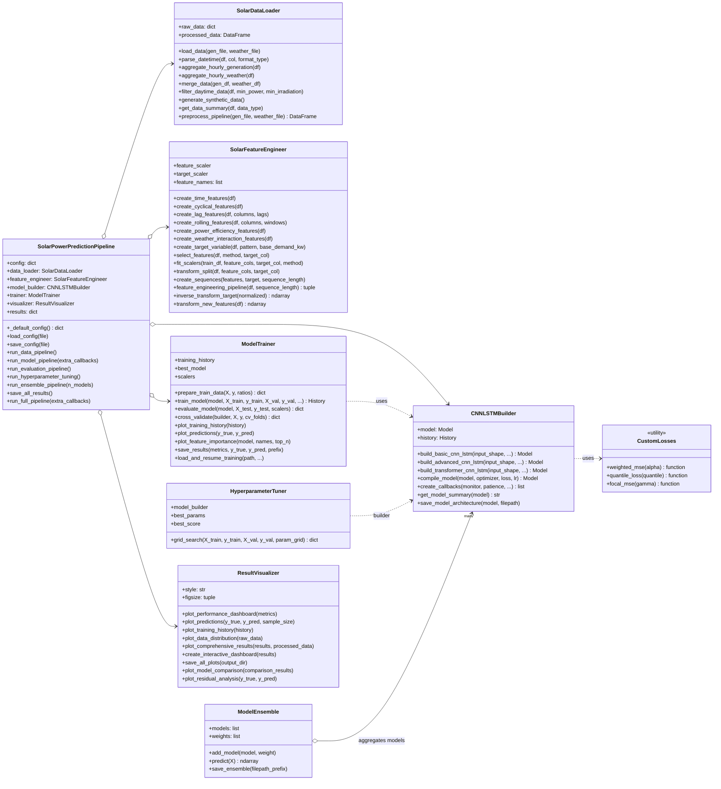
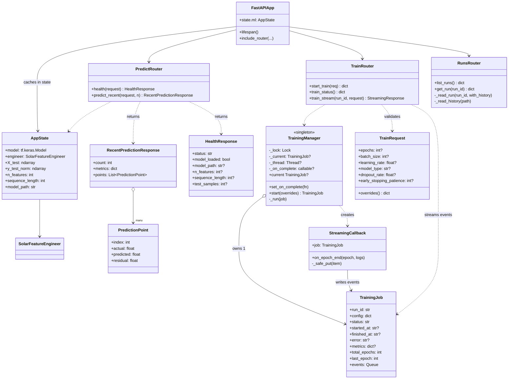
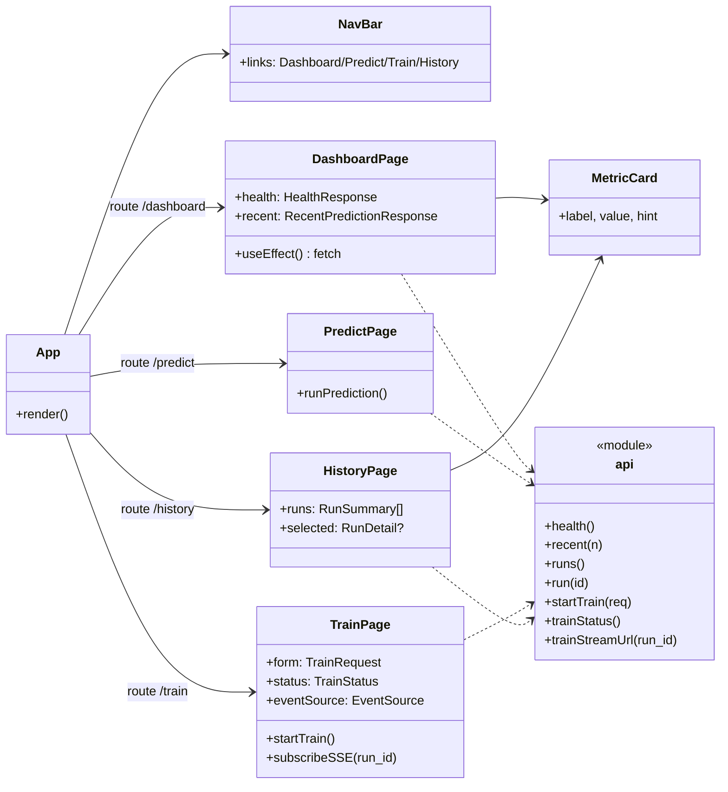
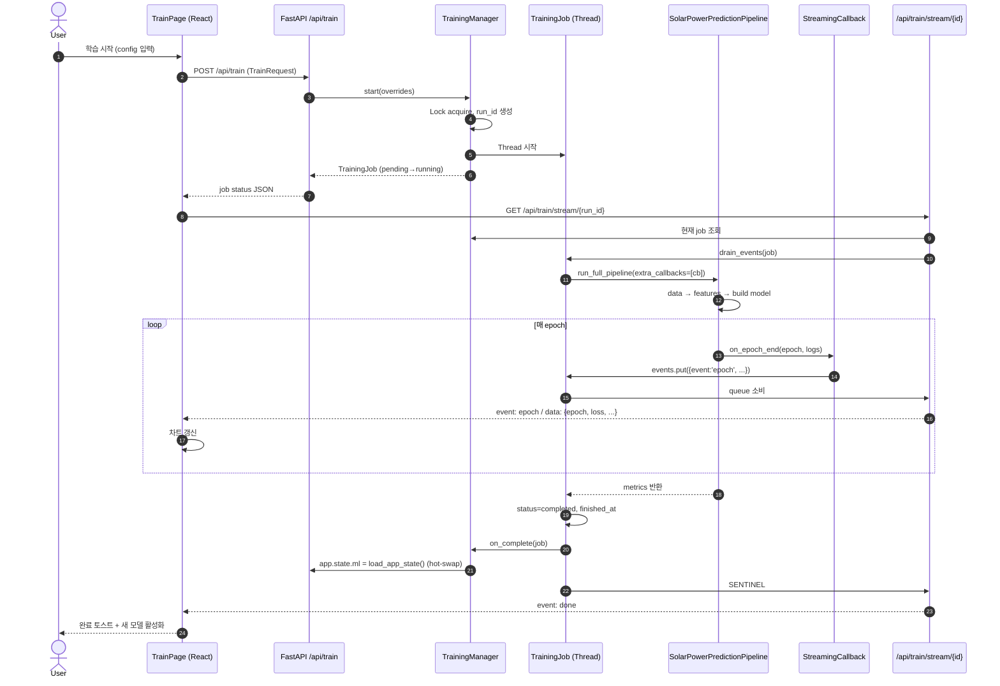
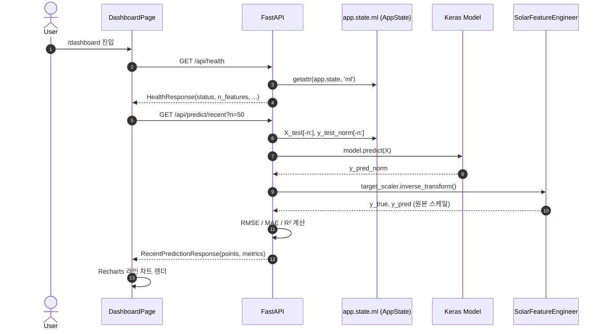
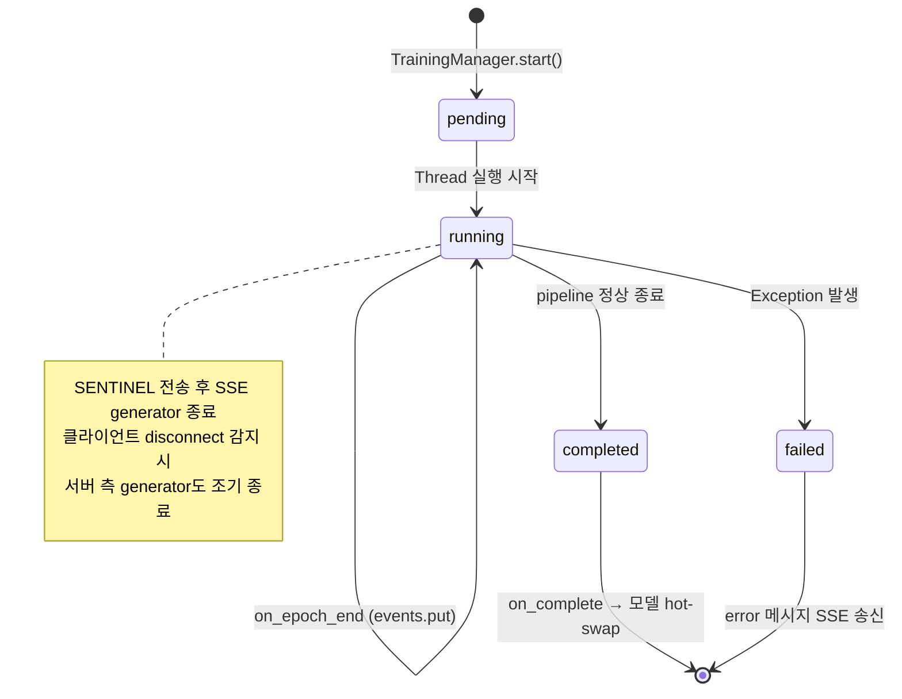
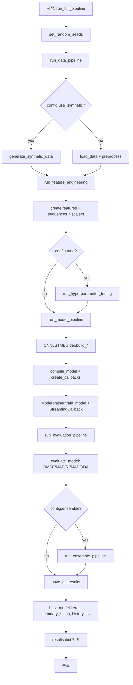
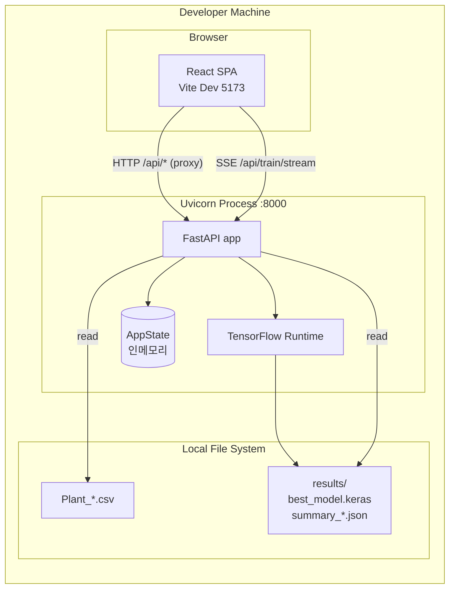
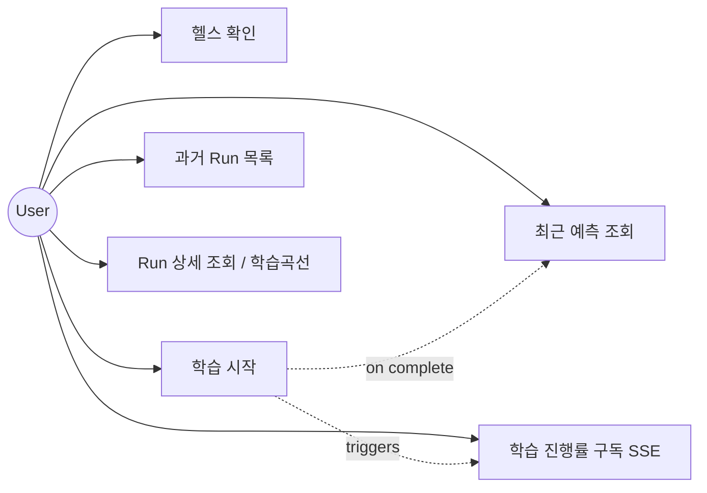
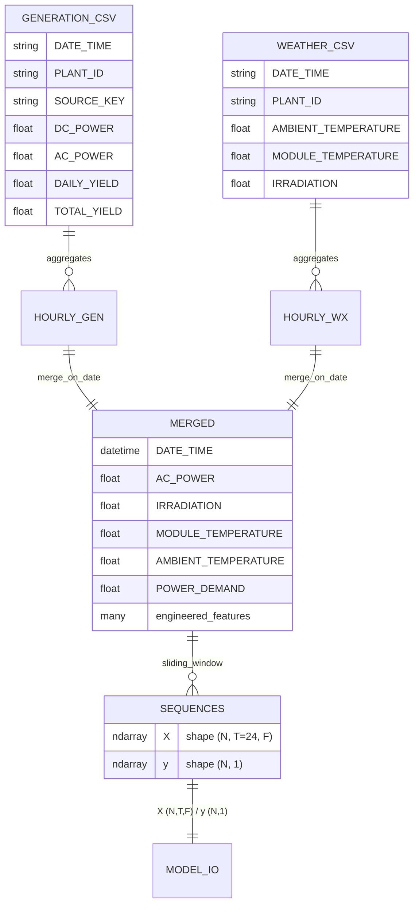

# 📐 UML 다이어그램

CNN-LSTM 태양광 발전 예측 시스템의 주요 UML 다이어그램입니다.
모든 다이어그램은 [Mermaid](https://mermaid.js.org/) 문법으로 작성되어 GitHub / VS Code 등에서 즉시 렌더링됩니다.

---

## 1. 클래스 다이어그램 — ML 파이프라인 (backend)

---

## 2. 클래스 다이어그램 — API 레이어 (backend/app)

---

## 3. 컴포넌트 다이어그램 (Frontend)

---

## 4. 시퀀스 다이어그램 — 학습 트리거 + SSE 진행률

---

## 5. 시퀀스 다이어그램 — 최근 예측 조회

---

## 6. 상태 다이어그램 — TrainingJob 라이프사이클

---

## 7. 활동 다이어그램 — 전체 파이프라인 (`SolarPowerPredictionPipeline.run_full_pipeline`)

---

## 8. 배포 다이어그램

---

## 9. 학습/예측 흐름 요약 (Use-Case 관점)

---

## 10. 데이터 모델 (입력/출력 스키마)

---

> 본 문서의 다이어그램은 모두 Mermaid이며 코드/구조 변경 시 함께 갱신해야 합니다.
> 클래스 시그니처는 `backend/*.py` / `backend/app/**/*.py` / `frontend/src/**/*.tsx` 의 실제 정의와 동기화되어야 합니다.
